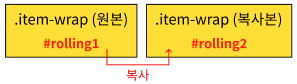

## 무한 롤링 슬라이더 (infiniteSideRolling)

1. [설명 및 이력](#설명-및-이력)
1. [코드](#코드)
    - [HTML](#html)
    - [css](#jl00scss)
    - [js](#jl00js)
1. [코드 설명](#코드-설명)
1. [문법 정리](#문법-정리)


----------------------------------------------------  

# 설명 및 이력

### 설명
- 오른쪽에서 왼쪽으로 무한으로 자동 슬라이드 되는 영역
- mouseover시 애니메이션이 멈추고, mouseleave시 다시 애니메이션 진행
- 활용할 곳 : 협력사, 무한 슬라이딩

### 이력
- 20231204 : 최초 작성

<br>

------------  

# 코드
### HTML
```
  <!-- infiniteSideRolling HTML -->
  <div id="infiniteSideRolling">
    <div class="item-wrap" id="rolling1">
      <div class="item">1</div>
      <div class="item">2</div>
      <div class="item">3</div>
      <div class="item">4</div>
      <div class="item">5</div>
      <div class="item">6</div>
      <div class="item">7</div>
      <div class="item">8</div>
      <div class="item">9</div>
      <div class="item">10</div>
    </div>
  </div>

  <!-- infiniteSideRolling SCRIPT -->
  <script>
    document.addEventListener("DOMContentLoaded", function() {
      jl.infiniteSideRolling("#infiniteSideRolling");
    });
  </script>
```

### jl0.0.SCSS
```
/* infiniteSideRolling CSS */
#infiniteSideRolling{
  width: 100%;
  background-color: aliceblue;
  overflow: hidden;
  display: flex;

  .item-wrap{
    width: 100%;
    display: flex;
    flex-shrink: 0;
    justify-content:space-around;
    &#rolling1{
      animation: infiniteSideRollingMove1 10s linear infinite;
    }
    &#rolling2{
      animation: infiniteSideRollingMove2 10s linear infinite;
    }
  }
  
  .item{
      width: 100px;
      height: 100px;
      background-color:antiquewhite;
      cursor: pointer;
      &:hover{
        background-color: burlywood;
      }
   } 
}
@keyframes infiniteSideRollingMove1 {
  0%{transform: translateX(0);}
  50%{transform: translateX(-100%);}
  50.01%{transform: translateX(100%);}
  100%{transform: translateX(0);}
}
@keyframes infiniteSideRollingMove2 {
  0%{transform: translateX(0);}
  100%{transform: translateX(-200%);}
}
```

### jl0.0.js
```
/* 무한 롤링 슬라이더 20231204 */
jl.infiniteSideRolling = function(rollingString){
  const customRolling = document.querySelector(rollingString);
  const itemWrapEl = customRolling.querySelector(".item-wrap");
  const itemEls = itemWrapEl.querySelector(".item");

  /* item-wrap 복제 및 생성 */
  let cloneItem = itemWrapEl.cloneNode(true);
  cloneItem.id = "rolling2";
  customRolling.appendChild(cloneItem)

  /* 마우스 오버시 애니메이션 스탑 */
  customRolling.addEventListener("mouseover",function(){
    this.querySelector("#rolling1").style.animationPlayState = 'paused';
    this.querySelector("#rolling2").style.animationPlayState = 'paused';
  })
   /* 마우스 리브시 애니메이션 실행 */
  customRolling.addEventListener("mouseleave",function(){
    this.querySelector("#rolling1").style.animationPlayState = 'running';
    this.querySelector("#rolling2").style.animationPlayState = 'running';
  })
}
```

<br>

------------  

# 코드 설명

1. .item-wrap(원본)을 복사본인 .item-wrap(복사본) 요소를 만들고, 복사본의 id명에 rolling2로 한다.
    ```
    const itemWrapEl = customRolling.querySelector(".item-wrap");
    let cloneItem = itemWrapEl.cloneNode(true);
    cloneItem.id = "rolling2";
    ```
    

<br>

2. 복사본 #rolling2를 상위 요소인 #infiniteSideRolling 에 자식요소로 붙인다.
    ```
    const customRolling = document.querySelector("#infiniteSideRolling");
    customRolling.appendChild(cloneItem)
    ```
    

<br>

3. 0%~50% 은 왼쪽으로 100% 이동, 50.01%에 우측으로 이동하여 100%까지 원위치로 돌아오는 애니메이션을 만들어 원본인 #rolling1에 적용한다. 
    - linear 일정한 속도, infinite 반복 
    ```
    #rolling1{animation: infiniteSideRollingMove1 10s linear infinite;}

    @keyframes infiniteSideRollingMove1 {
      0%{transform: translateX(0);}
      50%{transform: translateX(-100%);}
      50.01%{transform: translateX(100%);}
      100%{transform: translateX(0);}
    }
    ```
    

<br>

4. 왼쪽으로 200% 이동하는 애니메이션을 만들어 복사본인 #rolling2에 적용한다
    ```
    #rolling2{animation: infiniteSideRollingMove2 10s linear infinite;}

    @keyframes infiniteSideRollingMove2 {
      0%{transform: translateX(0);}
      100%{transform: translateX(-200%);}
    }
    ```
    

<br>

5. 전체적인 애니메이션은 아래와 같다. 0%~100%가 계속 반복됨
    

<br>

6. mouseover 이벤트 발생시, #rolling1과 #rolling2의 애니메이션을 중단한다.
    ```
    customRolling.addEventListener("mouseover",function(){
      this.querySelector("#rolling1").style.animationPlayState = 'paused';
      this.querySelector("#rolling2").style.animationPlayState = 'paused';
    })
    ```

6. mouseleave 이벤트 발생시, #rolling1과 #rolling2의 애니메이션을 실행한다.
    ```
    customRolling.addEventListener("mouseleave",function(){
      this.querySelector("#rolling1").style.animationPlayState = 'running';
      this.querySelector("#rolling2").style.animationPlayState = 'running';
    })
    ```

<br>

------------  
# 문법 정리

### dom 요소 복사 : cloneNode()
```
var copyNode = 요소.cloneNode(true)
```
- node를 복사하여 복사본을 리턴(copyNode) 함
- 요소의 하위요소까지 모두 복사 : .cloneNode(true)
- 요소의 하위요소를 제외하고 복사 : .cloneNode(false)

<br>

### 요소 자식으로 추가하기 : appendChild()
```
parent.appendChild(child)
```
- child(자식) 노드를 특정 parent(부모) 노드의 자식 노드 리스트 중 마지막 자식으로 추가함 

<br>

### 애니메이션 중단 및 실행 (css) : style.animationPlayState = "paused/running"
js
```
요소.style.animationPlayState = 'paused';
요소.style.animationPlayState = 'running';
```
css
```
요소 {
  animation-play-state : paused;
}
요소 {
  animation-play-state : running;
}
```