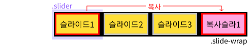
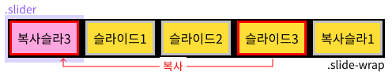
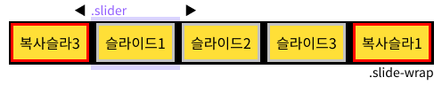
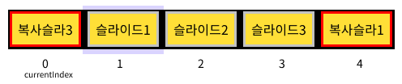
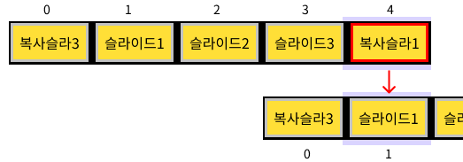
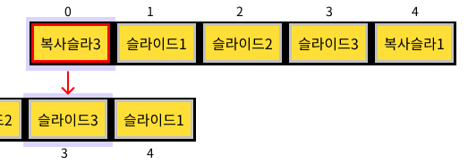
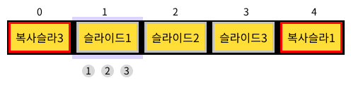
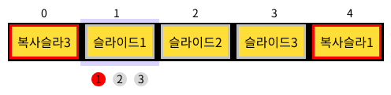
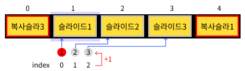

## 원섹션 무한 및 스와이프 슬라이드 (infiniteSlider)

<br>

1. [설명 및 이력](#설명-및-이력)
1. [코드](#코드)
    - [HTML](#html)
    - [css](#jl00scss)
    - [js](#jl00js)
1. [코드 설명](#코드-설명)
1. [문법 정리](#문법-정리)

<br>
<a href="https://jaydesign101.github.io/jlarbrary/html/infiniteSlider/index.html">화면보기</a>

<br>

----------------------------------------------------  

# 설명 및 이력

### 설명
- 양 옆으로 이동시 무한으로 슬라이드 이동 가능
- 스와이프로 옆으로 슬라이드 이동 가능
- bullet으로 화면 슬라이드 이동 가능

### 이력
- 20231204 : 최초 작성

<br>

------------  

# 코드
### HTML
```
<!-- infiniteSlider HTML -->
<div id="infiniteSlider">
<div class="btn-prev">이전</div>
<div class="btn-next">다음</div>
<div class="slider">
    <div class="slide-wrap">
    <div class="slide" style="background-color: antiquewhite;">1</div>
    <div class="slide">2</div>
    <div class="slide" style="background-color: antiquewhite;">3</div>
    <div class="slide">4</div>
    </div>
</div>
<div class="pagination"></div>
</div>

<!-- infiniteSlider SCRIPT -->
<script>
document.addEventListener("DOMContentLoaded", function() {
    jl.infiniteSlider("#infiniteSlider");
});
</script>
```

### jl0.0.SCSS
```
/* infiniteSlider CSS */
#infiniteSlider{
  position: relative;
  width: 100%;
  margin: 0 auto;
  user-select: none;
  // 이전 다음 버튼
  [class*="btn-"]{
    position: absolute;
    top:50%;
    transform: translateY(-50%);
    cursor: pointer;
    &.btn-prev{ left: 0; }
    &.btn-next{ right:0; }
  }

  // slider
  .slider{
    margin: 0 auto;
    width: calc(100% - 100px);
    overflow:hidden;
    border: 3px solid #000;
    .slide-wrap{
      display: flex;
      .slide{
        flex-shrink: 0;
        border: 1px solid #000; 
        width: 100%;
        height: 100px;
        display: flex;
        justify-content: center;
        align-items: center;
      }
    }
  }

  // pagination
  .pagination{
    display: flex;
    gap: .2em;
    position: absolute;
    bottom: 8px;
    left: 50%;
    transform: translateX(-50%);
    > div{
      flex-shrink: 0;
      width: 12px;
      height: 12px;
      font-size: 8px;
      text-align: center;
      border-radius: 50%;
      background-color: gray;
      cursor: pointer;
      &.active{
        background-color: red;
      }
    }
  }
}
```

### ### jl0.0.js
```
/* 원섹션 무한 및 스와이프 슬라이드 (infiniteSlider) 20231204 */
jl.infiniteSlider = function(sliderString){

  /* DOM 요소 */
  const customSlide = document.querySelector(sliderString);
  const sliderEl = customSlide.querySelector(".slider");
  const slideWrapEl = customSlide.querySelector(".slide-wrap");
  const slideEls = customSlide.querySelectorAll(".slide");
  const slideElsLength = slideEls.length;
  const paginationEl = customSlide.querySelector(".pagination");
 
  const btnPrevEl = document.querySelector(sliderString + "> .btn-prev");
  const btnNextEl = document.querySelector(sliderString + "> .btn-next");
  
  const cloneFirst = slideWrapEl.firstElementChild.cloneNode(true);
  const cloneLast = slideWrapEl.lastElementChild.cloneNode(true);

  /* 화면 초기 설정 */
  // 슬라이더 양 옆에 추가
  let currentIndex = 1; // 현재 슬라이더 인덱스
  slideWrapEl.appendChild(cloneFirst);
  slideWrapEl.insertBefore(cloneLast, slideWrapEl.firstElementChild);
  slideWrapEl.style.transform = `translateX( -100%)`;
  // pagination 요소 추가
  let paginationItem;
  slideEls.forEach(function (slide, index) {
    let pageNumber = index + 1; // 현재 슬라이더 인덱스를 pagination에 넣을 겁니당
    paginationItem = document.createElement('div');
    paginationItem.classList.add('pagination-item');
    paginationItem.textContent = pageNumber;
    paginationEl.appendChild(paginationItem);
  });
  const paginationItems = document.querySelectorAll('.pagination-item');
  paginationItems[0].classList.add('active');

  /* 슬라이드 클릭 *********************************************************/
  let isAnimating = false; // 애니메이션 진행 중 여부를 나타내는 변수 (클릭 한번에 애니메이션 한번)

  /* 슬라이더 transition 세팅 */
  function sliderSetTransition(transition, transform){
    slideWrapEl.style.transition = transition;
    slideWrapEl.style.transform = transform;
  }
  /* 슬라이더 페이지네이션 확인 */
  function sliderMove(currentIndex){
    sliderSetTransition(".3s", `translateX(${-currentIndex * 100}%)` )
    paginationItems.forEach(function (item) {
      item.classList.remove('active');
    });
    let activeIndex = currentIndex;
    if (activeIndex == slideElsLength + 1){
      activeIndex = 1;
    }else if(currentIndex == 0){
      activeIndex = slideElsLength;
    }
    paginationItems[activeIndex-1].classList.add('active');
  }
  /* 슬라이더 무한 세팅 */
  function sliderInfinite(){
    if (currentIndex == slideElsLength + 1){
      // 마지막 슬라이더일때
      sliderSetTransition("none", `translateX(-100%)`)
      currentIndex =1;
    } else if ((currentIndex == 0)){
      // 처음 슬라이더일때
      sliderSetTransition("none", `translateX( ${-slideElsLength * 100}%)`)
      currentIndex = slideElsLength;
    }
    return currentIndex;
  }

  /* 이전 버튼 클릭 */
  btnPrevEl.addEventListener("click", function() {
    if (!isAnimating) {
      currentIndex--;
      isAnimating = true; // 애니메이션이 시작됨을 표시
      sliderMove(currentIndex);
    }
  });

  /* 다음 버튼 클릭 */
  btnNextEl.addEventListener("click", function() {
    if (!isAnimating) {
      currentIndex++;
      isAnimating = true; // 애니메이션이 시작됨을 표시
      sliderMove(currentIndex);
    }
  });

  /* pagination 버튼 클릭 */
  paginationItems.forEach(function(item, index){
    item.addEventListener("click", function() {
        currentIndex = index + 1;
        sliderMove(currentIndex);
    })
  })

  /* transitionend 이벤트 리스너 추가 (transiton이 끝나면 transitionend 이 발생) */
  slideWrapEl.addEventListener('transitionend', function() {
    sliderInfinite();
    isAnimating = false; // 애니메이션이 끝남을 표시
  });

  /* Slider 스와이프 */
  let startPos = 0; // 시작 좌표
  let offset = 0; // 이동 좌표
  let sliderClick = false; // true일때만 스와이프 가능하도록
  let changePoint; // 스와이프 이동 기준 값

  function handleSwipeStart(e) {
    startPos = e.clientX || e.touches[0].clientX;
    sliderClick = true;
  }
  
  function handleSwipeMove(e) {
    if (sliderClick) {
      offset = (e.clientX || e.targetTouches[0].e.clientX) - startPos;
      sliderSetTransition("none", `translateX( calc( ${currentIndex} * -100% +  ${offset}px))`);
    }
  }
  
  function handleSwipeEnd() {
    sliderClick = false;
    changePoint = Math.round(slideWrapEl.offsetWidth / 4);
  
    if (changePoint < Math.abs(offset)) {
      if (offset < 0 && !isAnimating) {
        currentIndex++;
      } else if (offset > 0 && !isAnimating) {
        currentIndex--;
      } 
      offset = 0;
      isAnimating = true;
      sliderMove(currentIndex);
      setTimeout(function () {
        sliderInfinite();
        isAnimating = false;
      }, 300);

    } else {
      sliderMove(currentIndex);
    }
  }
  
  // 데스크탑 스와이프
  sliderEl.addEventListener("mousedown", handleSwipeStart);
  sliderEl.addEventListener("mousemove", handleSwipeMove);
  sliderEl.addEventListener("mouseup", handleSwipeEnd);
  sliderEl.addEventListener("mouseleave", handleSwipeEnd);
  
  // 모바일 스와이프
  sliderEl.addEventListener("touchstart", handleSwipeStart);
  sliderEl.addEventListener("touchmove", handleSwipeMove);
  sliderEl.addEventListener("touchend", handleSwipeEnd);
};
```

<br>

------------  

# 코드 설명

## 이동 버튼

1. 화면 초기 설정
    - 슬라이드1(.slide)를 복사하여 맨 끝에 붙인다.
    ```
    const slideWrapEl = customSlide.querySelector(".slide-wrap");
    const cloneFirst = slideWrapEl.firstElementChild.cloneNode(true);
    slideWrapEl.appendChild(cloneFirst);
    ```
    

    <br>

    - 슬라이드3(.slide)을 복사하여 맨 앞에 붙인다.  
    ```
    const cloneLast = slideWrapEl.lastElementChild.cloneNode(true);
    slideWrapEl.insertBefore(cloneLast, slideWrapEl.firstElementChild);
    ```
    

    <br>

    - slide-wrap을 왼쪽으로 100% 이동하여 슬라이드1이 .slider 영역 안에 오도록한다
    ```
    slideWrapEl.style.transform = `translateX( -100%)`;
    ```
    

<br>

2. isAnimating (애니메이션) 관련
    - 슬라이스가 진행되는 중간에는 버튼을 눌러도 동작되지 않도록 하는 변수(isAnimating)를 하나 지정한다.
    ```
    let isAnimating = false;
    ```
    - !isAnimating 은 true가 되니까 isAnimating가 false일때만 동작한다. 이때, isAnimating를 true로 바꾸면 click 이벤트는 동작할 수 없다.
    ```
    btnPrevEl.addEventListener("click", function() {
      if (!isAnimating) {
        isAnimating = true; // 애니메이션이 시작됨을 표시
      }
    });
    ```
    - 'transitionend' 은 CSS Transition이 완료되면 발생하는 이벤트이다. 'transitionend'가 되면 isAnimating를 false로 하면 다시 click 이벤트의 동작할 수 있다.
    ```
    slideWrapEl.addEventListener('transitionend', function() {
      isAnimating = false; // 애니메이션이 끝남을 표시
    });
    ```

<br>


3. 무한 루프 만들기 (sliderInfinite)
    - 현재 슬라이스 위치를 알 수 있는 변수(currentIndex)를 지정한다. currentIndex는 .슬라이드1 두번째 위치이기 때문에 1로 지정했다.
    ```
    let currentIndex = 1;
    ```
       
     <br>

    - 현재 슬라이드(currentIndex, 4)가 마지막 슬라이드(복사슬라1)일때, 두번째 슬라이드(슬라이드1)로 이동시키고 currentIndex를 1로 변경한다.
    ```
    const slideElsLength = document.querySelectorAll(".slide").length; //3개이므로 3

    function sliderInfinite(){
      if (currentIndex == slideElsLength + 1){
        slideWrapEl.style.transition = "none";
        slideWrapEl.style.transform = `translateX(-100%)`;
        currentIndex =1;
      }
      ...
    ```
    
    <br>

    - 현재 슬라이드(currentIndex, 0)가 첫번째 슬라이드(복사슬라3)일때, 마지막에서 두번째 슬라이드(슬라이드3)로 이동시키고 currentIndex를 3으로 변경시킨다. 변경된 currentIndex를 반환한다.

    ```
    ...
    else if ((currentIndex == 0)){
        slideWrapEl.style.transition = "none";
        slideWrapEl.style.transform = `translateX( ${-slideElsLength * 100}%)`;
        currentIndex = slideElsLength;
      }
      return currentIndex;
    }
    ```
      
    <br>

    - 애니메이션이 실행되면(버튼 이동시) 무한 루프 슬라이드 함수를 실행한다. 
    ```
    slideWrapEl.addEventListener('transitionend', function() {
        sliderInfinite();
    });
    ```


<br>

4. 이동 버튼
    - 버튼은 생성한다. 
    ```
    customSlide = document.querySelector("#infiniteSlider");
    const btnPrevEl = customSlide.querySelector(sliderString + "> .btn-prev");
    const btnNextEl = customSlide.querySelector(sliderString + "> .btn-next");    
    ```
    - 이전버튼 : currentIndex 감소
    ```
    btnPrevEl.addEventListener("click", function() {
      if (!isAnimating) {
        currentIndex--;
        isAnimating = true;
        slideWrapEl.style.transition = ".3s";
        slideWrapEl.style.transform = `translateX(${-currentIndex * 100}%)`;
        }
    });
    ```
    - 다음버튼 : currentIndex 증가
    ```
    btnNextEl.addEventListener("click", function() {
      if (!isAnimating) {
        currentIndex++;
        isAnimating = true;
        slideWrapEl.style.transition = ".3s";
        slideWrapEl.style.transform = `translateX(${-currentIndex * 100}%)`;
      }
    });
    ```

<br>

5. pagination 활성화
    - .slide(slideEls) 개수만큼 div 태그를 생성하고, class 명을 pagination-item라고 정한다. 생성된 pagination-item 안에 숫자를 넣는다. 다음, .pagination의 자식으로 붙인다.
    ```
    const slideEls = document.querySelectorAll(".slide");
    const paginationEl = document.querySelector(".pagination");

    let paginationItem;
    slideEls.forEach(function (slide, index) {
      let pageNumber = index + 1;
      paginationItem = document.createElement('div');
      paginationItem.classList.add('pagination-item');
      paginationItem.textContent = pageNumber;
      paginationEl.appendChild(paginationItem);
    });
    ```
      

    <br>
    
    - pagination-item(paginationItems) 의 첫번째 요소에 active라는 클래스명을 붙인다. (css로 active 클래스명이 붙였을때 활성화된 스타일을 적용한다.)  
    ```
    const paginationItems = document.querySelectorAll('.pagination-item');
    paginationItems[0].classList.add('active');
    ```
      

    <br>

    - paginationItems 의 각 요소(item) 을 클릭시, paginationItems의 인덱스에 +1 더하여 좌표 이동
    ```
    paginationItems.forEach(function(item, index){
      item.addEventListener("click", function() {
          currentIndex = index + 1;
          slideWrapEl.style.transition = ".3s";
          slideWrapEl.style.transform = `translateX( ${-currentIndex * 100}%)`;
    ...
    ```
      
    
    <br>

    - paginationItems의 class명에 active를 모두 없앤다. activeIndex는 paginationItems의 순서를 알려주는 변수로써, 맨 마지막이면 activeIndex를 첫번째로 바꾸고, 처음이면 마지막 숫자로 바꾼다. 해당 activeIndex 순서의 item에 active 클래스명을 붙인다. 

    ```
    ...
          paginationItems.forEach(function (item) {
            item.classList.remove('active');
          });
          let activeIndex = currentIndex;
          if (activeIndex == slideElsLength + 1){
            activeIndex = 1;
          }else if(currentIndex == 0){
            activeIndex = slideElsLength;
          }
          paginationItems[activeIndex-1].classList.add('active');
      })
    })
    ```

<br>

6. 스와이프
    - 스와이프 시작 : 마우스 다운, 터치 다운 했을때, 해당 x의 좌표를 구하여 startPos에 넣는다. sliderClick는 true로 변경한다.
    - e.clientX 는 PC일때의 X 좌표값, e.touches[0].clientX는 Mobile일때 X 좌표값이다

    ```
    let startPos = 0; // 시작 좌표
    let sliderClick = false; // true일때만 스와이프 가능하도록

    function handleSwipeStart(e) {
      startPos = e.clientX || e.touches[0].clientX;
      sliderClick = true; // 스와이프 이동 가능
    }
    ```

    <br>

    - 스와이프 이동 : 이동시키는 상태로 화면에 손가락이 닿아 있는 시점이다. 시작 좌표부터 몇 px 이동했는지 offset에 담고, 해당 좌표만큼 translate로 이동시킨다.
    - offset(이동 좌표) = 종료 좌표 - 시작 좌표 (만약 왼쪽으로 이동시 700-800=-100 이 되므로 마이너스, 만약 오른쪽으로 이동시 900-800=100이 되므로 플러스가 된다.)

    ```
    let offset = 0; // 이동 좌표

    function handleSwipeMove(e) {
        if (sliderClick) {
          offset = (e.clientX || e.targetTouches[0].clientX) - startPos;
          slideWrapEl.style.transition = 'none';
          slideWrapEl.style.transform = `translateX( calc( ${currentIndex} * -100% +  ${offset}px))`;
        }
      }
    ```

    <br>

    - 스와이프 종료 : 어디만큼 이동하면 화면전환이 되는지 changePoint를 지정하고, 이동거리(offset)이 changePoint보다 크면 다음 화면으로 이동하고, 적으면 화면을 유지한다. ... 

    ```
    let changePoint = Math.round(slideWrapEl.offsetWidth / 4); // 스와이프 이동 기준 값 25%

    function handleSwipeEnd() {
      sliderClick = false; // 스와이프 이동 불가능
    
      if (changePoint < Math.abs(offset)) {
        /* 화면 이동 코드  
        ... 
        */

      } else {
        /* 화면 유지 코드 */
        slideWrapEl.style.transition = ".3s";
        slideWrapEl.style.transform = `translateX(${-currentIndex * 100}%)`;
      }
    }
    ```
    <br>
    
    - 스와이프 종료 : /* 화면 이동 코드 */
      - offset이 마이너스이면 오른쪽 화면으로 이동, 플러스이면 왼쪽으로 이동한다.

      ```
      if (offset < 0 && !isAnimating) {
        currentIndex++;
      } else if (offset > 0 && !isAnimating) {
        currentIndex--;
      } 
      slideWrapEl.style.transition = ".3s";
      slideWrapEl.style.transform = `translateX(${-currentIndex * 100}%)`;
      ```

    <br>

    - 스와이프 종료 : /* 화면 이동 코드 */
      - offset을 0으로 하여 오류를 막는다.
      - 스와이프 애니메이션 도중에 다른 동작이 되지 않도록 isAnimating를 true로 바꾸어, .3초 동안 다른 동작이 되지 않도록 한다.

      ```
      offset = 0;
      isAnimating = true;

      setTimeout(function () {
        sliderInfinite();
        isAnimating = false;
      }, 300);
      ```

    <br>

    - 함수 지정 : 데스크탑은 mouse, 모바일은 touch로 인식되기 때문에 따로 지정해야 한다.
    ```
    // 데스크탑 스와이프
    sliderEl.addEventListener("mousedown", handleSwipeStart);
    sliderEl.addEventListener("mousemove", handleSwipeMove);
    sliderEl.addEventListener("mouseup", handleSwipeEnd);
    sliderEl.addEventListener("mouseleave", handleSwipeEnd);
    
    // 모바일 스와이프
    sliderEl.addEventListener("touchstart", handleSwipeStart);
    sliderEl.addEventListener("touchmove", handleSwipeMove);
    sliderEl.addEventListener("touchend", handleSwipeEnd);
    ```


<br>


------------  
# 문법 정리

### dom 요소 복사 : cloneNode()
```
var copyNode = 요소.cloneNode(true)
```
- node를 복사하여 복사본을 리턴(copyNode) 함
- 요소의 하위요소까지 모두 복사 : .cloneNode(true)
- 요소의 하위요소를 제외하고 복사 : .cloneNode(false)

<br>

### 요소 자식으로 추가하기 : appendChild()
```
parent.appendChild(child)
```
- child(자식) 노드를 특정 parent(부모) 노드의 자식 노드 리스트 중 마지막 자식으로 추가함 

<br>


### 특정 위치 앞에 노드 삽입 : insertBefore()
```
parent.insertBefore(삽입할 노드, 위치)
```
- "삽입할 노드"를 parent(부모)의 "위치" 번째 노드 앞에 삽입함
- parent.insertBefore(Node, parent.firstElementChild); : 맨 앞에 노드를 삽입

<br>


### CSS Transition 종료시 발생하는 이벤트 : transitionend
```
slideWrapEl.addEventListener('transitionend', function() {
  /* 코드 */
  });
```
- CSS Transition이 완료되면 발생한다.
- transition 속성이 제거된 경우, display가 none으로 설정된 경우, 이벤트가 발생하지 않음
- 동작이 끝나기 전에 다른 동작이 실행되면 오류가 날 가능성이 있다. 동작이 끝나기 전에는 다르 동작이 실행하지 못하도록, (마치 제이쿼리의 stop()처럼) 막는 기능을 할 수 있다.
  ```
  let isAnimating = false;

  Btn.addEventListener("click", function() {
    if (!isAnimating) {
      isAnimating = true; // 애니메이션이 시작됨을 표시
    }
  });

  slideWrapEl.addEventListener('transitionend', function() {
    isAnimating = false; // 애니메이션이 끝남을 표시
  });
  ```

<br>

### 요소 개수 구하기 : 요소.length
```
Node.length;
```
- 배열 및 index는 0부터 시작하지만 length는 개수로써 1개부터 시작한다.
- 만약 3개의 요소가 있다면 3개가 됨

<br>

### 반복문 : forEach()
```
const nodeItems = document.querySelectorAll('.복수 요소');

nodeItems.forEach(function (item, index) {
  /* 코드 */
})
```
- item은 nodeItems의 각 아이템을 의미한다.
- index는 nodeItems의 각 인덱스를 의미한다.

<br>

### 클래스명 추가하기 : .classList.add()
```
요소.classList.add('className');
```
- 요소에 className이라는 클래스명을 추가한다.
- <요소 class="className"> 이 된다.
- 같은 클래스명이 있다면 무시된다.

<br> 

### 요소에 text 문자열 넣기 : textContent
```
요소.textContent
```
- 'node'의 속성으로, script나 style 태그 상관 없이 해당 노드가 가지고 있는 텍스트값을 그대로 가져온다.
- {display:none} 으로 되어있는 텍스트도 가져온다.
```
요소.textContent = "문자열";
```
- 요소 텍스트에 "문자열"을 넣는다. (기존에 텍스트가 있다면 삭제)

<br>

### 뷰포트 기준 xy값 구하기 : clientX, clientY
```
e.clientX;
e.clientY;
```

- 브라우저에서 사용자에게 보여지는 웹페이지 기준으로 x,y값을 구한다.
- 스크롤바로 화면이 이동하더라도 좌표값은 일정하다.

<br>

### 터치 기준 xy값 구하기
```
e.touches[0].clientX
```
- touches[0]는 첫번째 터치가 닿았을때의 값이다

<br>

### 요소 너비 구하기
```
요소.offsetWidth
```
- border가 포함된 요소의 크기를 구한다

<br>

### 일정 시간 후 동작하는 함수
```
setTimeout(function () {
  /* 1초 후에 동작할 코드*/
}, 1000);
```

<br>

### 절대값 구하기
```
Math.abs(난수)
```
- 난수가 양수라면 양수를, 난수가 음수라면 양수를 반환한다.

<br>

### 반올림
```
Math.round(난수);
```

<br>

